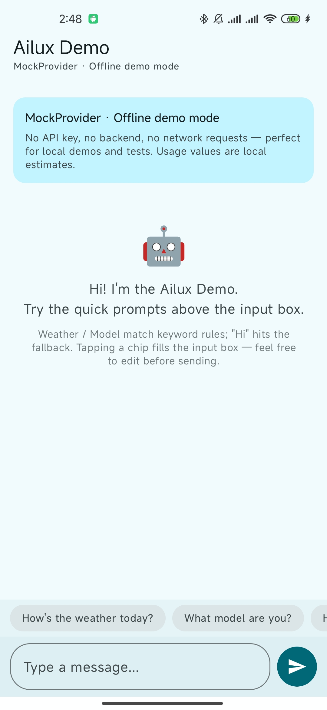
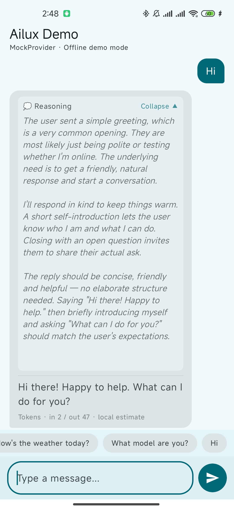

[English](README.md) | 中文

# Ailux


[](https://search.maven.org/artifact/io.github.kynnchuan/ailux-sdk)

Ailux 是一个面向 Android 的轻量级 LLM SDK，帮你在几分钟内接入任意大语言模型。用 `MockProvider` 零配置跑通完整 Chat UI，再一行配置切换到 `BackendProxyProvider` 对接自建后端——同一套流式 API，生产级安全。

### 定位与边界

Ailux 是一个**面向 Android 的轻量 LLM 接入层，而不是 Agent 框架。** 它刻意保持厂商中立（OpenAI / Anthropic / DeepSeek / 任意 OpenAI 兼容接口），且不绑定任何单一云生态，适合走自建后端、或使用非 Gemini / 国内模型的团队。

- 想要**最小化、厂商中立、以自建后端代理为核心的流式客户端** —— 选 **Ailux**。
- 需要**与 Gemini 生态深度整合的多智能体编排**（云端 Gemini + 端侧 Gemini Nano）—— 选 **[Google ADK for Android](https://developer.android.google.cn/ai/adk?hl=zh-cn)**（2026-05-21 发布）。

### 为什么选 Ailux？

| 痛点 | Ailux 方案 |
| --- | --- |
| 各厂商 SDK 碎片化 | 统一 `LLMProvider` 抽象——切换 OpenAI、Anthropic、DeepSeek 或任何兼容接口，业务代码零改动。 |
| SSE 流式处理复杂 | 一个 `Flow<LLMEvent>` 搞定：`Token` / `Reasoning` / `Usage` / `Error` / `ToolCallReceived` / `Done`。 |
| APK 内嵌 Key 泄露风险 | `BackendProxyProvider` 把凭据留在服务端；直连云端路径受 `@OptIn(DirectCloudUsage::class)` 门控。 |
| 没有 Key 就没法开发 | `MockProvider`——完全离线、行为确定、零依赖。跑 Demo、写测试、新人上手即刻开始。 |
| Android 生命周期管理头疼 | 内置 5 种生命周期策略 + ViewModel 开箱即用。 |
| 错误处理不统一 | 统一 `ErrorCode` + `LLMError`，自带 `isRetriable` 标记与自动重试。 |
| 依赖膨胀 | 一行 `implementation("io.github.kynnchuan:ailux-sdk:0.1.0")`，全部搞定。 |
| 多厂商协议差异 | 可插拔 `StreamResponseParser`（内置 OpenAI + Anthropic 解析器），自定义只需 ~20 行。 |

> **v0.1 以单个聚合依赖发布。** 一行 `implementation(...)` 即可获得核心契约层、API 门面、Android 集成层、MockProvider 和 BackendProxyProvider。v1.0 起拆分子模块，方便按需接入。

## v0.1 一览

- **单依赖接入** —— 一个 Maven 坐标覆盖全部功能。
- **`MockProvider`** —— 无 API Key、无后端、无网络，即刻跑通 Chat Demo。
- **`BackendProxyProvider`** —— 对接自建后端代理（生产推荐）。
- **`directCloudConfig(...)`** —— Opt-in 直连云端，快速验证（BYOK，需 `@OptIn`）。
- **流式事件模型** —— `Token` / `Reasoning` / `Usage` / `Error` / `Done`。
- **请求取消** —— 随时 `Ailux.cancel()` 或 `client.cancel()`。
- **多实例支持** —— 同进程内通过 `AiluxClient` 并行运行 Mock + 真实 Provider。
- **Android Compose Demo** —— 逐 token 渲染、思考过程折叠、Usage 展示。

<p align="center">
  
  
</p>

> Demo 视频：[`assets/demo/v0.1-chat-demo.mp4`](assets/demo/v0.1-chat-demo.mp4)

📲 **立即体验：** [下载 Demo APK (v0.1.0)](assets/demo/ailux-demo-v0.1.0.apk) —— 基于 `MockProvider` 完全离线运行，无需 API Key。

## Roadmap

| 状态 | 功能 |
| --- | --- |
| ✅ 已发布 | MockProvider、BackendProxyProvider、流式事件、请求取消、多实例 `AiluxClient`、Android 生命周期集成、Compose Chat Demo |
| ✅ v0.2.0 | Function Calling — OpenAI & Anthropic 协议解析、`ToolCallAggregator`、多轮 FC 循环、`AnthropicRequestMapper` |
| ✅ v0.2.1 | LLMContextManager — 三阶段裁剪管线 + `FcMessageProtector` + `EstimatedTokenCounter` |
| ✅ v0.2.2 | 官方 Backend 样板（`samples/ailux-backend-sample`，Spring Boot）+ 运行时 Mock↔Backend 切换 |
| ✅ v0.2.3 | 并发协调（`ConcurrencyPolicy`）+ 停滞检测 + Per-Request `LLMTask` + `handle{}`/`tokenFlow()` DSL |
| ✅ v0.2.4 | LLMRequest 三层扩展范式（`overrides`）+ 多模态传输（`attachments`）+ 请求幂等（`Idempotency-Key`）— [扩展指南](docs/EXTENSIBILITY-zh.md) |
| 🚧 v0.2.5 进行中 | Provider 扩展点决策树（[扩展性指南 Part 2](docs/EXTENSIBILITY-zh.md#第二部分--provider-四个扩展点决策树v025)）+ `AiluxLogger` SPI + `PrivacyConfig`（[日志策略](docs/LOGGING-zh.md)）+ `DiagnosticReport`（脱敏报告，[Issue 模板](.github/ISSUE_TEMPLATE/bug_report_zh.yml)） |
| 💡 探索中 | 端侧推理运行时（v0.3 端侧线）、子模块拆分（细粒度接入） |

> Roadmap 可能调整。"计划中"与"探索中"不代表确定的发布时间。

## 接入

在 app/library 模块的 `build.gradle.kts` 中添加单个聚合依赖：

```kotlin
dependencies {
    implementation("io.github.kynnchuan:ailux-sdk:0.1.0")
}
```

就这一行。**不需要**再分别接 `ailux-core` / `ailux-api` / `ailux-android` / `ailux-provider-mock` / `ailux-provider-backend` —— 聚合模块用 `api` 透出全部子模块。

> 仓库需包含 `mavenCentral()`：
>
> ```kotlin
> // settings.gradle.kts
> dependencyResolutionManagement {
>     repositories {
>         google()
>         mavenCentral()
>     }
> }
> ```

## Quick Start

按你的场景三选一。三种方式共用同一套 `Ailux.streamGenerate(...)` API，**只有 Provider 构造方式不同**。

### 方式 A —— `MockProvider`（无 API Key、无网络）

适合本地开发、Demo 演示、单元测试。

```kotlin
import com.ailux.api.Ailux
import com.ailux.api.AiluxConfig
import com.ailux.core.model.LLMEvent
import com.ailux.core.model.LLMRequest
import com.ailux.provider.mock.MockProvider

Ailux.init(
    AiluxConfig.Builder()
        .setProvider(MockProvider())
        .build()
)

Ailux.streamGenerate(LLMRequest(messages = listOf(Message.User("hello"))))
    .collect { event ->
        when (event) {
            is LLMEvent.Token     -> print(event.text)
            is LLMEvent.Reasoning -> print(event.text)
            is LLMEvent.Usage     -> println("usage: ${event.info}")
            is LLMEvent.Error     -> println("error: ${event.error}")
            is LLMEvent.Done      -> println("done")
        }
    }
```

### 方式 B —— `BackendProxyProvider`（生产推荐）

请求经由**你自己的**后端代理转发到真实模型服务，凭据始终保留在服务端。

**1. 把凭据写到 `local.properties`（不要提交）**

```properties
# local.properties
ailux.baseUrl=https://your-backend.example.com
ailux.apiKey=YOUR_BACKEND_TOKEN
```

**2. 在 app `build.gradle.kts` 中桥接到 `BuildConfig`**

```kotlin
// app/build.gradle.kts
import java.util.Properties

val localProperties = Properties().apply {
    val f = rootProject.file("local.properties")
    if (f.exists()) f.inputStream().use { load(it) }
}

android {
    defaultConfig {
        buildConfigField("String", "AILUX_BASE_URL", "\"${localProperties.getProperty("ailux.baseUrl", "")}\"")
        buildConfigField("String", "AILUX_API_KEY",  "\"${localProperties.getProperty("ailux.apiKey",  "")}\"")
    }
    buildFeatures { buildConfig = true }
}
```

**3. 配置 Provider**

```kotlin
import com.ailux.api.Ailux
import com.ailux.api.AiluxConfig
import com.ailux.core.model.LLMRequest
import com.ailux.provider.backend.AuthProvider
import com.ailux.provider.backend.BackendProxyConfig
import com.ailux.provider.backend.BackendProxyProvider

val backendConfig = BackendProxyConfig(
    baseUrl = BuildConfig.AILUX_BASE_URL,
    streamEndpoint   = "/v1/chat/stream",     // 你的接口
    generateEndpoint = "/v1/chat/generate",   // 你的接口
    authProvider = AuthProvider {
        // 返回完整 Authorization 头（含 scheme 前缀）。
        "Bearer ${BuildConfig.AILUX_API_KEY}"
    }
)

Ailux.init(
    AiluxConfig.Builder()
        .setProvider(BackendProxyProvider())
        .setProviderConfig(backendConfig)
        .build()
)

Ailux.streamGenerate(LLMRequest(messages = listOf(Message.User("hello"))))
    .collect { /* 同方式 A */ }
```

> **Parser 说明：** `BackendProxyProvider` 默认使用内置的 OpenAI 兼容 `StreamResponseParser`。如果你的后端返回不同的协议格式，可以自定义 request/response parser——详见 [API 参考](docs/API-zh.md)。

### 方式 C —— `directCloudConfig(...)`（BYOK，仅适合原型验证）

如果你**还没有**自建的后端代理，只想用自己的云端 Key 端到端验证 SDK，Ailux 提供一个 opt-in 工厂方法，可直接对接 OpenAI 兼容协议的云端接口。

> ⚠️ **隐私与安全提醒**
>
> - 把云端 API Key 直接打进 Android App，意味着任何反编译 APK 的人都可能拿到你的 Key。
> - 用户 Prompt 与模型回复会**直接**离开设备发往上游云厂商，没有你服务端的内容审核、审计与限流。
> - **此方式仅适合个人原型验证。** 任何对外的 C 端场景，都请切换为方式 B（BackendProxyProvider）。
> - 因此该 API 受 opt-in 注解保护，必须显式写 `@OptIn(DirectCloudUsage::class)`。

```kotlin
import com.ailux.api.Ailux
import com.ailux.api.AiluxConfig
import com.ailux.core.model.LLMRequest
import com.ailux.provider.backend.BackendProxyProvider
import com.ailux.provider.backend.DirectCloudUsage
import com.ailux.provider.backend.directCloudConfig

@OptIn(DirectCloudUsage::class)
fun setupDirectCloud() {
    val config = directCloudConfig(
        baseUrl = "https://api.deepseek.com",
        apiKey  = BuildConfig.AILUX_API_KEY
        // streamEndpoint / generateEndpoint 默认 "/chat/completions"
    )

    Ailux.init(
        AiluxConfig.Builder()
            .setProvider(BackendProxyProvider())
            .setProviderConfig(config)
            .build()
    )

    Ailux.streamGenerate(
        LLMRequest(
            prompt = "hello",
            model  = "deepseek-v4-flash"
        )
    ).collect { /* 同方式 A */ }
}
```

方式 C 对应的 `local.properties`：

```properties
# local.properties
ailux.baseUrl=https://api.deepseek.com   # 仅作占位，实际 URL 已硬编码在上面
ailux.apiKey=sk-your-deepseek-key
```

## 高级用法

- [扩展性指南](docs/EXTENSIBILITY-zh.md)（v0.2.4+）—— 第一部分：`LLMRequest` 三层扩展模型（强类型 / `overrides` / 自定义 `RequestMapper` 决策树 + `extras → overrides` 迁移）；第二部分（v0.2.5+）：Provider 四个扩展点决策树（mapper / parser / errormapper / authprovider 何时该写、4 个完整单测示例）。
- [日志策略与隐私契约](docs/LOGGING-zh.md)（v0.2.5+）—— `AiluxLogger` SPI（Timber / SLF4J / Sentry 桥接示例）、`PrivacyConfig`（默认全脱敏）、字段分类表、自定义扩展点的隐私守则。
- [诊断报告（DiagnosticReport）](docs/DIAGNOSTICS-zh.md)（v0.2.5+）—— `task.lastDiagnostic()` / `Ailux.createDiagnosticReport()` 入口、`toShareableText()` 输出格式、与 Issue Forms 的串接。
- [docs/API-zh.md](docs/API-zh.md) —— 自定义 Mock 规则、自定义 `AuthProvider`、流式事件、请求取消、一次性调用、多实例 Client、测试等完整 API 参考。

## Demo 依赖模式

示例 `app` 模块支持三种依赖模式，通过 `gradle.properties` 中的 `AILUX_DEP_MODE` 控制：

| 值 | 行为 |
| --- | --- |
| `source`（默认） | 通过 `project(":ailux-xxx")` 依赖本地源码模块，适合日常开发。 |
| `maven-umbrella` | 依赖已发布的单一聚合 artifact `io.github.kynnchuan:ailux-sdk:<version>`。 |
| `maven-split` | 依赖已发布的细分 artifact（`ailux-api`、`ailux-android`、`ailux-provider-*`）。 |

切换方式 - 编辑 `gradle.properties`：

```properties
AILUX_DEP_MODE=maven-umbrella
```

或通过命令行临时覆盖（不修改文件）：

```bash
./gradlew :samples:chat-demo:assembleDebug -PAILUX_DEP_MODE=maven-umbrella
```

> **注意：** Maven 模式需要对应 artifact 可用。可先执行 `./gradlew publishToMavenLocal` 发布到本地，或确保 Maven Central 上已有对应版本。

## 模块结构

`io.github.kynnchuan:ailux-sdk:0.1.0` 聚合 artifact 通过 `api` 透出以下全部模块：

| 模块 | 用途 |
| --- | --- |
| `ailux-core` | 核心契约层：`LLMProvider` / `LLMRequest` / `LLMResponse` / `LLMEvent`。 |
| `ailux-api`  | API 门面层：`Ailux` / `AiluxClient` / `AiluxConfig`。 |
| `ailux-android` | Android 端集成胶水层。 |
| `ailux-provider-mock` | 零依赖 Mock Provider，用于本地开发 / Demo / 测试。 |
| `ailux-provider-backend` | BackendProxy Provider + opt-in `directCloudConfig(...)` 工厂。 |
| `app` | Compose Chat Demo 示例工程。 |

> v1.0 起将允许独立依赖单个子模块（`io.github.kynnchuan:ailux-core`、`...:ailux-provider-mock` 等），方便细粒度接入。在此之前，**优先使用聚合 artifact `ailux-sdk`**。

## 隐私与安全

- **不要把真实 API Key 提交到仓库。** 放在 `local.properties`、环境变量或密钥管理服务里。
- **不要在 Issue / PR / 日志 / 截图中暴露用户原文 prompt、模型回复或业务敏感数据。**
- 生产环境请走方式 B（自建后端代理），把凭据、内容审核、审计日志、限流都留在服务端。
- `MockProvider` 完全离线，可放心用于公开 Demo、录屏、CI。
- `directCloudConfig(...)` 使用 `@RequiresOptIn(level = ERROR)` 限制是**有意为之** —— 它**不**是推荐的生产方案。

其他文档在 [docs/](docs/) 目录下 —— [API 参考](docs/API-zh.md) · [CONTRIBUTING](docs/CONTRIBUTING-zh.md) · [CHANGELOG](docs/CHANGELOG-zh.md)。
