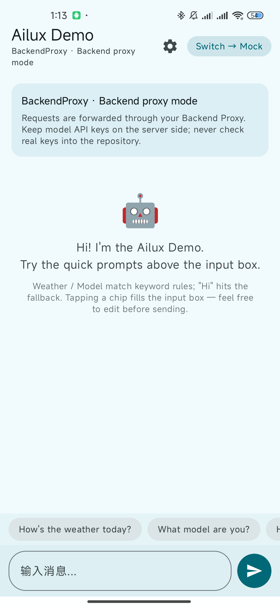
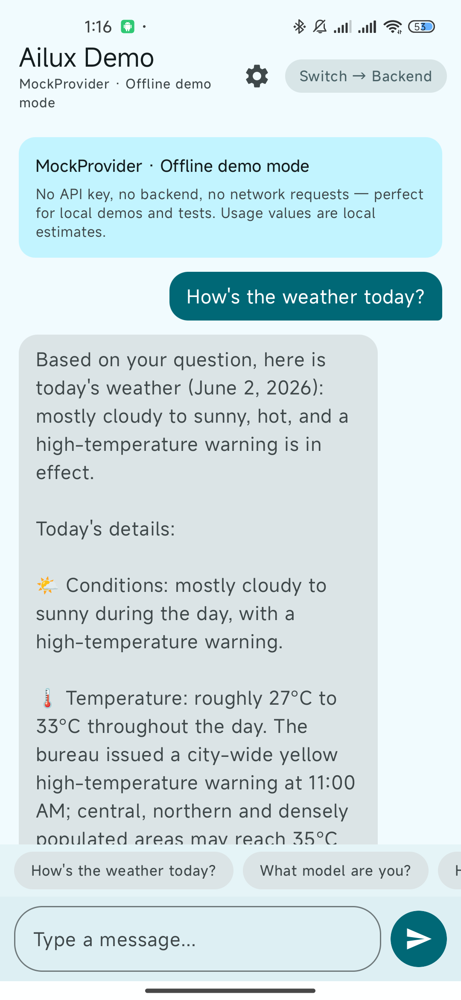
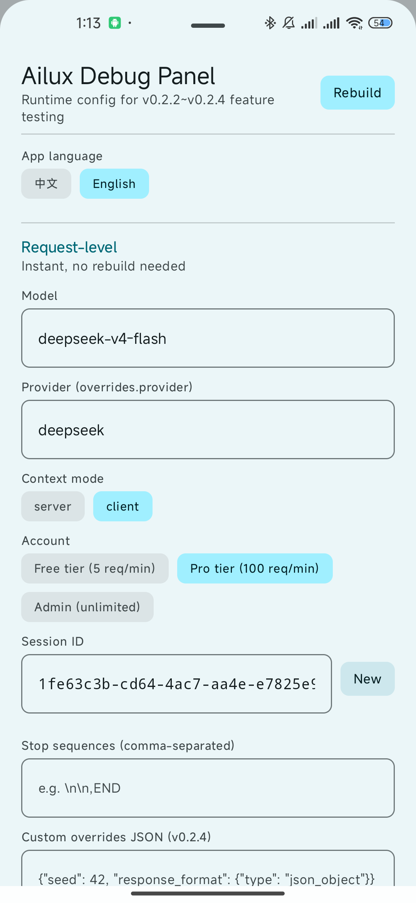
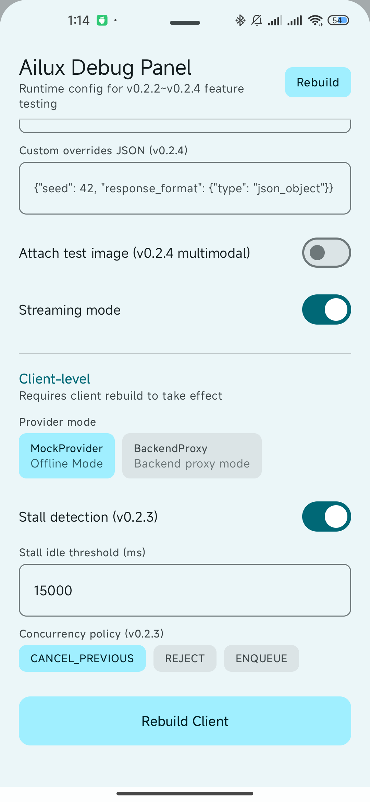

English | [中文](README-zh.md)

# Ailux


[](https://search.maven.org/artifact/io.github.kynnchuan/ailux-sdk)

Ailux is a lightweight Android LLM SDK that lets you integrate any large language model in minutes. Ship a working Chat UI with **zero** API keys using `MockProvider`, then flip one config to route through your own backend with `BackendProxyProvider` — same streaming API, production-ready security.

### Scope & positioning

Ailux is a **lightweight LLM access layer for Android — not an agent framework.** It stays deliberately vendor-neutral (OpenAI / Anthropic / DeepSeek / any OpenAI-compatible endpoint) and independent of any single cloud ecosystem, so it fits teams routing through their own backend or using non-Gemini / regional models.

- Choose **Ailux** if you want a minimal, vendor-neutral streaming client centered on your own backend proxy.
- Choose **[Google ADK for Android](https://developer.android.com/ai/adk)** (released 2026-05-21) if you need full multi-agent orchestration tightly integrated with the Gemini ecosystem (cloud Gemini + on-device Gemini Nano).

### Why Ailux?

| Pain point | Ailux solution |
| --- | --- |
| Fragmented vendor SDKs | Unified `LLMProvider` abstraction — swap OpenAI, Anthropic, DeepSeek, or any compatible endpoint without touching business code. |
| Complex SSE streaming | One `Flow<LLMEvent>` model: `Token` / `Reasoning` / `Usage` / `Error` / `ToolCallReceived` / `Done`. |
| API key leaks in APK | `BackendProxyProvider` keeps credentials server-side; direct-cloud path is gated by `@OptIn(DirectCloudUsage::class)`. |
| Can't develop without a real key | `MockProvider` — fully offline, deterministic, zero dependencies. Run demos, write tests, onboard teammates instantly. |
| Android lifecycle headaches | 5 lifecycle policies + ViewModel integration out of the box. |
| Inconsistent error handling | Unified `ErrorCode` + `LLMError` with `isRetriable` flag and automatic retry. |
| Dependency bloat | Single `implementation("io.github.kynnchuan:ailux-sdk:0.2.6")` — one line, everything included. |
| Multi-vendor protocol quirks | Pluggable `StreamResponseParser` (OpenAI + Anthropic built-in); add your own in ~20 lines. |
| Function Calling protocol drift | OpenAI / Anthropic SSE FC unified into `LLMEvent.ToolCallReceived`; `ToolCallAggregator` reassembles fragments and multi-turn FC stays in your business code. |
| Context overflow / 413 | `LLMContextManager` three-stage trim pipeline + `FcMessageProtector` keeps FC pairs intact, zero changes to business logic. |
| Concurrent request chaos | `ConcurrencyPolicy` + per-request `LLMTask` handle + stall detection cover timeout / cancel / back-pressure in one model. |
| Logs leaking user data | `PrivacyConfig` redacts by default + `AiluxLogger` SPI bridges Timber / SLF4J / Sentry; `DiagnosticReport` produces a shareable redacted report. |
| Production-grade backend wiring | v0.2.6 hardening: exp-backoff + `Retry-After` retries, `HttpClientConfig` lets you inject a custom `OkHttpClient` (mTLS / cert pinning / proxy), `AuthProvider.onUnauthorized` auto-refreshes & replays on 401 (single-flight, separate budget) + `AUTH_EXPIRED` error grading + `RequestSigner` per-request signing. |

## What's in the box (v0.2 line)

- **Single-dependency install** — one Maven coordinate covers everything.
- **`MockProvider`** — no API key, no backend, no network. Instant Chat Demo.
- **`BackendProxyProvider`** — talks to your own backend proxy (production-recommended), production-hardened in v0.2.6.
- **`directCloudConfig(...)`** — opt-in direct-to-cloud for quick prototyping (BYOK; requires `@OptIn`).
- **Streaming event model** — `Token` / `Reasoning` / `Usage` / `Error` / `ToolCallReceived` / `Done`.
- **Function Calling protocol parsing** — OpenAI & Anthropic, `ToolCallAggregator` reassembles fragments, multi-turn FC orchestrated by your code.
- **LLMContextManager** — three-stage trim pipeline + `FcMessageProtector` + pluggable `TokenCounter` to avoid context overflow.
- **Concurrency & stall detection** — `ConcurrencyPolicy`, per-request `LLMTask` handle, `handle{}` / `tokenFlow()` DSL, TTFT / decode-phase stall detection.
- **Three-tier request extensibility** — strong-typed fields / `overrides` structured escape hatch / custom `RequestMapper`; plus multimodal `attachments` and `Idempotency-Key`.
- **Privacy & diagnostics** — `PrivacyConfig` redacts by default, `AiluxLogger` SPI, `DiagnosticReport` one-call shareable redacted report with an Issue template for self-service reporting.
- **BackendProxy production hardening (v0.2.6)** — `NonStreamResponseParser`, `RetryPolicy` (exp backoff + jitter + `Retry-After`), `HttpClientConfig` / `ProtocolConfig` three-way split, `AuthProvider.onUnauthorized` 401 auto-refresh + replay, `AUTH_EXPIRED` error grading, `RequestSigner`.
- **Official Backend sample** — `samples/ailux-backend-sample`, a Spring Boot monolith demonstrating SSE forwarding, server + client FC, model routing, auth & quota, abort-on-disconnect.
- **Multi-instance support** — run Mock + real providers concurrently via `AiluxClient`, with runtime switching.
- **Android Compose Demo** — incremental token rendering, collapsible reasoning, usage display, Debug Panel for extension config.

<p align="center">
  
  
  
  
</p>

> Screenshots above (left to right): runtime provider switch (Mock ↔ BackendProxy), MockProvider streaming a built-in rule, and the Debug Panel runtime config for v0.2.2~v0.2.4 features (overrides JSON / context mode / account / stop sequences / multimodal toggle / concurrency policy / stall detection).

📲 **Try it now:** [Download Demo APK](assets/demo/ailux-demo-v0.2.6.apk) — runs entirely offline with `MockProvider`, no API key needed.

## Install

Add the single umbrella artifact to your app/library module:

```kotlin
dependencies {
    implementation("io.github.kynnchuan:ailux-sdk:0.2.6")
}
```

> Make sure `mavenCentral()` is in your repositories block:
>
> ```kotlin
> // settings.gradle.kts
> dependencyResolutionManagement {
>     repositories {
>         google()
>         mavenCentral()
>     }
> }
> ```

## Quick Start

Just **2 steps** to wire Ailux into your app: pick a provider in step 1, stream a response in step 2.

### Step 1 — `Ailux.init(...)`: pick **one** of three providers

All three providers share the **same** Session-first API. Only the `AiluxConfig` you hand to `Ailux.init(...)` differs.

<details>
<summary><b>① <code>MockProvider</code> — no API key, no network</b> · best for local development, demos, and unit tests</summary>

```kotlin
import com.ailux.api.Ailux
import com.ailux.api.AiluxConfig
import com.ailux.provider.mock.MockProvider

Ailux.init(
    AiluxConfig.Builder()
        .setProvider(MockProvider())
        .build()
)
```

</details>

<details open>
<summary><b>② <code>BackendProxyProvider</code> — recommended for production</b> · request is forwarded via <b>your own</b> backend proxy, upstream model key stays server-side, the device holds only a user-scoped token issued by your backend</summary>

```kotlin
import com.ailux.api.Ailux
import com.ailux.api.AiluxConfig
import com.ailux.provider.backend.AuthProvider
import com.ailux.provider.backend.BackendProxyConfig
import com.ailux.provider.backend.BackendProxyProvider

val backendConfig = BackendProxyConfig(
    baseUrl          = "https://your-backend.example.com",
    streamEndpoint   = "/v1/chat/stream",     // your endpoint
    generateEndpoint = "/v1/chat/generate",   // your endpoint
    authProvider = AuthProvider {
        // Return the COMPLETE Authorization header value (including the scheme).
        // This is the token YOUR backend issues to the current user — NOT an upstream model key.
        "Bearer ${currentUser.backendToken}"
    }
)

Ailux.init(
    AiluxConfig.Builder()
        .setProvider(BackendProxyProvider())
        .setProviderConfig(backendConfig)
        .build()
)
```

> **Parser note:** by default `BackendProxyProvider` uses the built-in OpenAI-compatible `StreamResponseParser`. If your backend returns a different protocol, supply a custom request/response parser — see the [extensibility guide](docs/EXTENSIBILITY.md).
>
> **Need a real backend implementation?** See `samples/ailux-backend-sample` (Spring Boot) — SSE forwarding, server / client FC, model routing, auth & quota, abort-on-disconnect.

</details>

<details>
<summary><b>③ <code>directCloudConfig(...)</code> — BYOK, prototype only</b> · point the SDK directly at an OpenAI-compatible cloud endpoint with your own key</summary>

> ⚠️ **Embedding a cloud API key inside an Android app exposes it to anyone who reverse-engineers your APK.** User prompts and responses leave the device without server-side moderation, audit, or rate limiting. Use this only for personal prototyping; for anything user-facing, switch to ②. The API is gated by `@OptIn(DirectCloudUsage::class)` on purpose.

**1. Put the cloud key in `local.properties` (do not commit)**

```properties
# local.properties
ailux.baseUrl=https://api.deepseek.com
ailux.apiKey=sk-your-deepseek-key
```

**2. Bridge to `BuildConfig` in your app `build.gradle.kts`**

```kotlin
import java.util.Properties

val localProperties = Properties().apply {
    val f = rootProject.file("local.properties")
    if (f.exists()) f.inputStream().use { load(it) }
}

android {
    defaultConfig {
        buildConfigField("String", "AILUX_BASE_URL", "\"${localProperties.getProperty("ailux.baseUrl", "")}\"")
        buildConfigField("String", "AILUX_API_KEY",  "\"${localProperties.getProperty("ailux.apiKey",  "")}\"")
    }
    buildFeatures { buildConfig = true }
}
```

**3. Wire it via `directCloudConfig(...)`**

```kotlin
import com.ailux.api.Ailux
import com.ailux.api.AiluxConfig
import com.ailux.provider.backend.BackendProxyProvider
import com.ailux.provider.backend.DirectCloudUsage
import com.ailux.provider.backend.directCloudConfig

@OptIn(DirectCloudUsage::class)
fun setupDirectCloud() {
    val config = directCloudConfig(
        baseUrl = BuildConfig.AILUX_BASE_URL,
        apiKey  = BuildConfig.AILUX_API_KEY
        // streamEndpoint / generateEndpoint default to "/chat/completions"
    )

    Ailux.init(
        AiluxConfig.Builder()
            .setProvider(BackendProxyProvider())
            .setProviderConfig(config)
            .build()
    )
}
```

</details>

### Step 2 — `Ailux.openSession(...)`: stream a turn

After `init(...)`, the rest is identical regardless of which provider you picked. Open a [`Session`](docs/API.md#session-api), call `streamGenerateAsTask(...)`, and `collect` the events:

```kotlin
import com.ailux.api.Ailux
import com.ailux.core.event.LLMEvent
import com.ailux.core.message.Message
import com.ailux.core.request.LLMRequest

Ailux.openSession().use { session ->
    session
        .streamGenerateAsTask(LLMRequest(messages = listOf(Message.User("hello"))))
        .events
        .collect { event ->
            when (event) {
                is LLMEvent.Token             -> print(event.text)
                is LLMEvent.Reasoning         -> print(event.text)
                is LLMEvent.ToolCallReceived  -> handleToolCalls(event.toolCalls)
                is LLMEvent.Usage             -> println("usage: ${event.info}")
                is LLMEvent.Error             -> println("error: ${event.error}")
                is LLMEvent.Done              -> println("done: ${event.finishReason}")
                else                          -> { /* StallDetected / Connected / ContextTrimmed / ToolCallDelta */ }
            }
        }
}
```

That's the whole integration — `init(...)` once at app startup, `openSession().streamGenerateAsTask(...)` per turn. Keep the session open across turns and the LLM backend (local KV-cache or cloud history accumulator) reuses prior context for you automatically.

> Need the full reply in one shot? `session.generate(request)` suspends until the stream is fully drained and returns an aggregated `LLMResponse`.

---

### Prefer instances over a singleton? — `AiluxClient`

`Ailux` is just a thin process-wide singleton over an internal `AiluxClient`. If you need multiple concurrent providers (e.g. Mock + Backend side by side), per-feature configs, or scoped instances inside a DI graph, construct `AiluxClient` directly — the **2-step shape stays the same**.

```kotlin
import com.ailux.api.AiluxClient
import com.ailux.api.AiluxConfig
import com.ailux.core.event.LLMEvent
import com.ailux.core.message.Message
import com.ailux.core.request.LLMRequest
import com.ailux.provider.mock.MockProvider

// Step 1 — build a client (same AiluxConfig shape; pick any of the 3 providers above).
val client = AiluxClient(
    AiluxConfig.Builder()
        .setProvider(MockProvider())
        .build()
)

// Step 2 — open a Session and request an LLMTask handle for the turn.
client.openSession().use { session ->
    val task = session.streamGenerateAsTask(
        LLMRequest(messages = listOf(Message.User("hello")))
    )

    task.events.collect { event ->
        when (event) {
            is LLMEvent.Token -> print(event.text)
            is LLMEvent.Done  -> println("done")
            else              -> { /* ... */ }
        }
    }

    // Cancel just this task; other tasks on the same client keep running.
    // task.cancel()
}

// When the client is no longer needed (e.g. ViewModel.onCleared()):
// client.release()
```

> Both `Ailux.openSession(...)` and `AiluxClient.openSession(...)` return a [`Session`](docs/API.md#session-api). The session's `streamGenerateAsTask(...)` returns an `LLMTask` — `task.events` is the cold flow you collect, `task.cancel()` cancels just that turn, and `task.state` / `task.lastDiagnostic()` give you observability.
>
> **v0.3.0b breaking change.** The pre-v0.3.0b shortcuts `Ailux.streamGenerate(req)` / `Ailux.generate(req)` and `client.streamGenerate(req)` / `client.generate(req)` have been **removed** — Session is now the single entry point (see [ADR-0009](ailux-docs/decisions/adr/0009-session-only-single-pipeline.md)). Migrate by wrapping each call in `client.openSession().use { it.streamGenerateAsTask(req) }` (or `it.generate(req)` for the non-streaming variant).

## Advanced Usage

- [Extensibility guide](docs/EXTENSIBILITY.md) (v0.2.4+) — Part 1: `LLMRequest` three-tier model (strong-typed / `overrides` / custom `RequestMapper` decision tree). Part 2 (v0.2.5+): Provider four-extension-point decision tree (when to write a custom mapper / parser / errormapper / authprovider, with 4 complete unit-test examples).
- [Logging policy & privacy contract](docs/LOGGING.md) (v0.2.5+) — `AiluxLogger` SPI (Timber / SLF4J / Sentry bridge examples), `PrivacyConfig` (redacted by default), field classification table, privacy rules for custom extension points.
- [Diagnostic report](docs/DIAGNOSTICS.md) (v0.2.5+) — `task.lastDiagnostic()` / `Ailux.createDiagnosticReport()` entries, `toShareableText()` output format, wiring with the Issue Forms template.
- [docs/API.md](docs/API.md) — full API reference: custom mock rules, custom `AuthProvider`, streaming events, request cancellation, one-shot generation, multiple clients, testing.

## Demo dependency mode

The sample `app` module supports three dependency modes, controlled by `AILUX_DEP_MODE` in `gradle.properties`:

| Value | Behavior |
| --- | --- |
| `source` (default) | Depends on local source modules via `project(":ailux-xxx")`. Best for development. |
| `maven-umbrella` | Depends on the single published artifact `io.github.kynnchuan:ailux-sdk:<version>`. |
| `maven-split` | Depends on individual published artifacts (`ailux-api`, `ailux-android`, `ailux-provider-*`). |

Switch by editing `gradle.properties`:

```properties
AILUX_DEP_MODE=maven-umbrella
```

Or override on the command line without modifying any file:

```bash
./gradlew :samples:chat-demo:assembleDebug -PAILUX_DEP_MODE=maven-umbrella
```

> **Note:** Maven modes require the artifacts to be available. Publish to local first with `./gradlew publishToMavenLocal`, or ensure the version is live on Maven Central.

## Modules

The `io.github.kynnchuan:ailux-sdk:0.2.6` umbrella artifact transitively (`api`) re-exports all of these:

| Module | Purpose |
| --- | --- |
| `ailux-core` | Core contract layer: `LLMProvider`, `LLMRequest`, `LLMResponse`, `LLMEvent`. |
| `ailux-api`  | API facade: `Ailux`, `AiluxClient`, `AiluxConfig`. |
| `ailux-android` | Android-side integration glue. |
| `ailux-provider-mock` | Zero-dependency mock provider for local dev / demos / tests. |
| `ailux-provider-backend` | BackendProxy provider + opt-in `directCloudConfig(...)` factory; v0.2.6 adds `RetryPolicy` / `HttpClientConfig` / `ProtocolConfig` / `RequestSigner`. |
| `app` | Sample Compose Chat Demo with runtime Mock↔Backend switching and a Debug Panel. |
| `samples/ailux-backend-sample` | Official Spring Boot reference backend — SSE forwarding, server / client FC, model routing, auth & quota, abort-on-disconnect. **Not** published as a Maven artifact. |

> v1.0 will let you depend on individual sub-modules (`io.github.kynnchuan:ailux-core`, `...:ailux-provider-mock`, etc.) for finer-grained adoption. Until then, prefer the umbrella artifact `ailux-sdk`.

## Privacy and security

- **Never commit real API keys to the repository.** Keep them in `local.properties`, environment variables, or a secret manager.
- **Never expose raw user prompts, model responses, or business-sensitive data** in issues, PRs, logs, or screenshots.
- For production, route requests through your own backend (Option B) so credentials, moderation, audit logging, and rate limiting stay server-side.
- `MockProvider` is fully offline and safe for public demos, screen recordings, and CI.
- The `directCloudConfig(...)` path is gated by `@RequiresOptIn(level = ERROR)` on purpose — it is **not** a recommended production path.

Other docs under [docs/](docs/) — [API Reference](docs/API.md) · [CONTRIBUTING](docs/CONTRIBUTING.md) · [CHANGELOG](docs/CHANGELOG.md).
